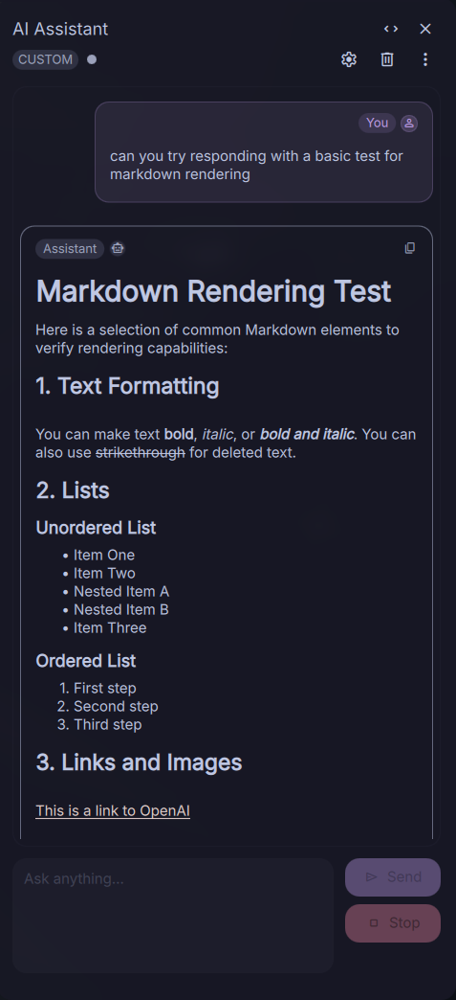
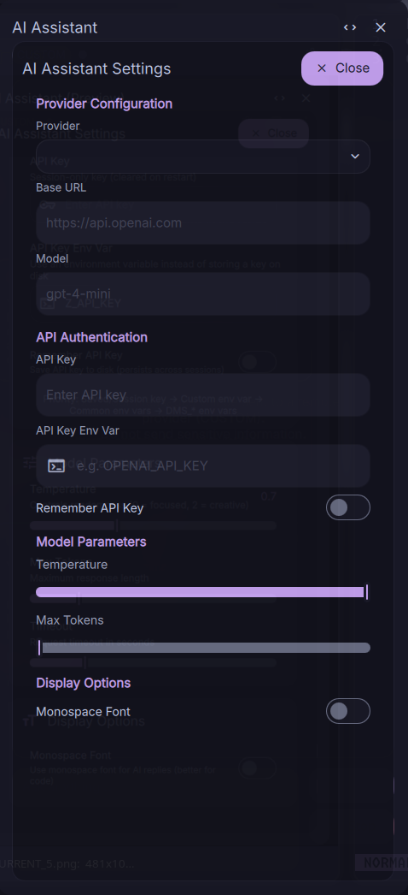

# AI Assistant Plugin for DankMaterialShell

An integrated AI chat assistant plugin for DankMaterialShell with support for multiple AI providers, streaming responses, and markdown rendering.



## Features

- **Multiple AI Provider Support**: OpenAI, Anthropic, Google Gemini, and custom OpenAI-compatible APIs
- **Streaming Responses**: Real-time streaming of AI responses with proper cancellation support
- **Markdown Rendering**: Full markdown support with syntax highlighting for code blocks
- **Persistent Chat History**: Conversations are saved and restored across sessions
- **Flexible Configuration**: Per-provider settings for model, temperature, max tokens, and more
- **API Key Management**: Store API keys securely or use environment variables
- **Session-based Keys**: Option to use in-memory API keys that don't persist to disk
- **Monospace Font Option**: Toggle monospace rendering for technical discussions

## Screenshots

| Chat Interface | Settings Panel |
|----------------|----------------|
|  |  |

## Requirements

- **DankMaterialShell**: Version with plugin toggle support [(PR pending)](https://github.com/AvengeMedia/DankMaterialShell/pull/1407)
  - The core DMS plugin system needs `togglePlugin()` support
  - See [DankMaterialShell PR](https://github.com/AvengeMedia/DankMaterialShell/pull/1407) for details
- **Qt/QML**: Qt 6.x with QtQuick support (provided by Quickshell)
- **Dependencies**: `curl` for HTTP requests, `wl-copy` for clipboard operations

## Installation

### Via Plugin Directory

1. Clone this repository to your DMS plugins directory:

   ```bash
   mkdir -p ~/.config/DankMaterialShell/plugins
   cd ~/.config/DankMaterialShell/plugins
   git clone https://github.com/devnullvoid/dms-ai-assistant.git AIAssistant
   ```

2. Restart DankMaterialShell:

   ```bash
   dms restart
   ```

3. Enable the plugin:
   - Open DMS Settings → Plugins
   - Find "AI Assistant" in the list
   - Toggle it to enabled

## Configuration

### Provider Setup

The plugin supports multiple AI providers. Configure your preferred provider in the settings panel:

> **Note**: Model names change frequently as providers release new versions. Check official provider documentation for the latest available models:
> - [OpenAI Models](https://platform.openai.com/docs/models)
> - [Anthropic Models](https://docs.anthropic.com/en/docs/about-claude/models)
> - [Google Gemini Models](https://ai.google.dev/gemini-api/docs/models)

#### OpenAI

```
Provider: openai
Base URL: https://api.openai.com
Model: gpt-5-mini-2025-08-07 (or gpt-5.2-2025-12-11, gpt-5-nano-2025-08-07, etc.)
API Key: Your OpenAI API key
```

#### Anthropic (Claude)

```
Provider: anthropic
Base URL: https://api.anthropic.com
Model: claude-sonnet-4-5-20250929 (or claude-haiku-4-5-20251001, etc.)
API Key: Your Anthropic API key
```

#### Google Gemini

```
Provider: gemini
Base URL: https://generativelanguage.googleapis.com
Model: gemini-3-flash-preview (or gemini-3-pro-preview, etc.)
API Key: Your Google API key
```

#### Custom Provider

For any OpenAI-compatible API (LocalAI, Ollama, LM Studio, etc.):

```
Provider: custom
Base URL: http://localhost:1234/v1 (your API endpoint)
Model: Your model name
API Key: Optional (leave empty for local APIs)
```

### API Key Options

1. **Store in Settings** (Remember API Key toggle ON)
   - API key is saved to `~/.config/DankMaterialShell/plugin_settings.json`
   - Persists across restarts
   - More convenient but stored on disk

2. **Environment Variable** (Recommended for security)
   - Set API Key Env Var field (e.g., `OPENAI_API_KEY`)
   - API key read from environment variable
   - Not stored in settings files
   - More secure

3. **Session-only** (Remember API Key toggle OFF)
   - Enter API key each session
   - Stored in memory only
   - Cleared on restart

### Model Parameters

- **Temperature** (0.0 - 2.0): Controls randomness in responses
  - Lower (0.0-0.5): More focused and deterministic
  - Higher (1.0-2.0): More creative and varied

- **Max Tokens** (128 - 32768): Maximum response length
  - Adjust based on your needs and model limits
  - Higher values = longer responses but more API cost

## Usage

### Opening the Assistant

The AI Assistant can be triggered via:

1. **IPC Command**:

   ```bash
   dms ipc call plugins toggle aiAssistant
   ```

2. **Keybind**: Configure in your compositor configuration

### Chat Interface

- **Send Message**: Type your message and press `Ctrl+Enter` or click "Send"
- **Stop Generation**: Click "Stop" while streaming
- **Clear History**: Click trash icon to clear conversation
- **Copy Response**: Use overflow menu → "Copy last reply"
- **Retry**: If a request fails, use overflow menu → "Retry"

### Keyboard Shortcuts

- `Ctrl+Enter`: Send message
- `Escape`: Close assistant

## Settings Reference

All settings are stored in `~/.config/DankMaterialShell/plugin_settings.json` under the `aiAssistant` key.

Example configuration:

```json
{
  "aiAssistant": {
    "enabled": true,
    "provider": "custom",
    "baseUrl": "https://api.example.com/v1",
    "model": "glm-4.7",
    "apiKeyEnvVar": "PROVIDER_API_KEY",
    "saveApiKey": false,
    "useMonospace": true,
    "temperature": 0.7,
    "maxTokens": 4096
  }
}
```

## Session Data

Chat history is saved to `~/.local/state/DankMaterialShell/plugins/aiAssistant/session.json`:

- Automatically saved after each message
- Limited to last 50 messages (configurable in code)
- Cleared when chat history is manually cleared
- Invalidated when provider settings change

## Troubleshooting

### Settings Not Persisting

If settings don't persist after restart:

- Check `~/.config/DankMaterialShell/plugin_settings.json` exists and is writable
- Ensure DMS has write permissions to config directory

### API Errors

- **401 Unauthorized**: Check API key is correct
- **404 Not Found**: Verify base URL and model name
- **Connection Failed**: Check internet connection and API endpoint
- **Timeout**: Increase timeout setting or check network latency

### No Response Streaming

- Some providers/models may not support streaming
- Check browser console for error messages
- Verify API endpoint supports SSE (Server-Sent Events)

### Markdown Not Rendering

- Ensure code blocks use triple backticks with language specifier
- Check if markdown2html.js is present in plugin directory

## Development

### File Structure

```
AIAssistant/
├── plugin.json              # Plugin manifest
├── AIAssistantDaemon.qml    # Main daemon/slideout controller
├── AIAssistant.qml          # Chat interface UI
├── AIAssistantService.qml   # Backend service (API calls, state)
├── AIAssistantSettings.qml  # Settings panel UI
├── AIApiAdapters.js         # Provider-specific API adapters
├── markdown2html.js         # Markdown to HTML conversion
├── MessageBubble.qml        # Individual message component
└── MessageList.qml          # Message list container
```

### Adding Custom Providers

To add a new provider, edit `AIApiAdapters.js`:

1. Add provider configuration to `PROVIDER_CONFIGS`
2. Implement request formatting in `formatRequest()`
3. Implement response parsing in `parseStreamChunk()`

Example:

```javascript
PROVIDER_CONFIGS: {
    myProvider: {
        name: "My Provider",
        streamEndpoint: "/v1/chat/completions",
        authHeader: "Authorization",
        authPrefix: "Bearer ",
        supportsStreaming: true
    }
}
```

### Contributing

Contributions are welcome! Please:

1. Fork the repository
2. Create a feature branch
3. Make your changes
4. Test thoroughly with DMS
5. Submit a pull request

## License

MIT License - see [LICENSE](LICENSE) file for details

## Credits

- **Author**: Jon Rogers
- **DankMaterialShell**: [DankMaterialShell Project](https://github.com/dankamongmen/DankMaterialShell)
- **Markdown Rendering**: Adapted from markdown-it.js
- **QML/Qt**: [Qt Project](https://www.qt.io/)

## Support

For issues, questions, or feature requests:

- Open an issue on GitHub
- Join the DankMaterialShell community discussions
- Check DMS documentation for plugin system details

## Roadmap

- [ ] Multi-turn conversation context management
- [ ] Conversation branching/forking
- [ ] Export conversations to markdown
- [ ] Custom system prompts
- [ ] Conversation templates/presets
